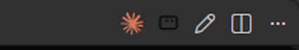
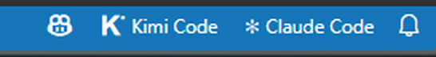
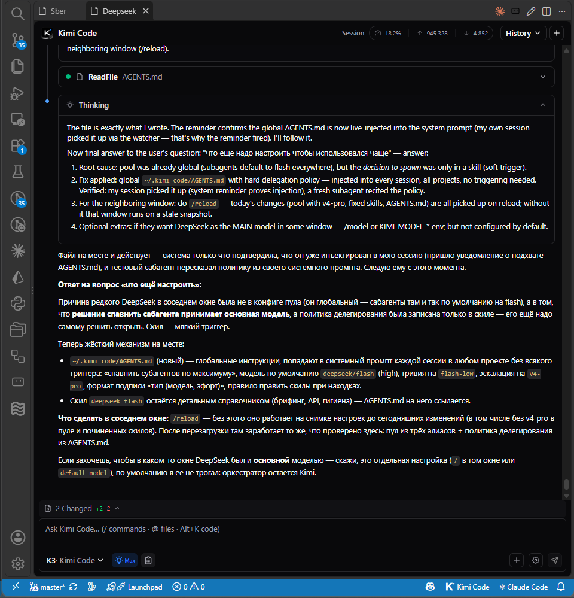

# Kimi Code Companion

Companion extension for the official **Kimi Code** VS Code extension (`moonshot-ai.kimi-code`). It adds the quality-of-life features the stock extension lacks:

- **Restores Kimi windows after "Developer: Reload Window"** — with their custom titles, editor column, and **conversation history**;
- **Buttons**: a Kimi icon in the editor title bar (new window), a pencil next to it (rename window), and a "K Kimi Code" button on the right side of the status bar;
- **Rename Kimi windows** (`Kimi Code: Rename Window`);
- **Automatic window titles from the conversation topic** (while a window is still called "Kimi Code", the title is taken from the session's `title`/`lastPrompt`);
- **`Kimi Code: Reopen Closed Window`** — reopens the last closed Kimi window (remembers up to 5);
- **`Kimi Code: Usage`** — the current subscription quota (5h / 7d / monthly limits plus the booster wallet) as a separate report, with live rate-window counters (used/limit, e.g. `37/100`), pace, depletion forecast and reset countdown;
- **DeepSeek balance in the Usage report and status bar tooltip** (reads the `[providers.deepseek]` key from the Kimi Code config);
- **Threshold alerts** — native VS Code notifications with a per-window latch: the 5-hour window at ≥ 80%, the monthly limit at ≥ 90%, and the DeepSeek balance below $1 (`kimiCompanion.alerts`, `kimiCompanion.alertThreshold5h`, `kimiCompanion.alertThresholdMonth`, `kimiCompanion.alertDeepseekBelowUsd`);
- **Usage in the status bar** — two values, the monthly limit first and then the 5-hour window (e.g. `M 16% · 5h 82%`), refreshed every 5 minutes (`kimiCompanion.usageInStatusBar`); the bar turns red when a short window (≤ 1 day) is projected to deplete before its reset;
- **Copilot-style status bar menu** — clicking the button opens an expanded QuickPick: quota rows with their values on the right, a usage bar and details below (counter, pace, reset countdown), then the actions (Refresh quota, New window, Reopen closed window) and the list of open windows to focus; quota rows are informational — clicking one just closes the menu and does not open a separate report (the `Kimi Code: Usage` report stays available from the command palette); Refresh quota refetches the data and reopens the menu; the menu is localized to the VS Code UI language (en / ru / zh-cn; pace phrases stay English);
- **`Ctrl+Alt+K`** (`Cmd+Alt+K` on macOS) — new Kimi window;
- **`Kimi Code: Diagnostics`** — a state report: versions, all 7 patches, hooks, windows, saved state;
- Restores the conversation in the Kimi **sidebar** as well.

Activity log: View → Output → channel **"Kimi Code Companion"**.

## Screenshots

*Editor title bar buttons*

*Status bar button with usage percent*

*Restored windows with custom titles and history*

> **Unofficial project.** Not affiliated with Moonshot AI. "Kimi" and the Kimi logo belong to Moonshot AI. Distributed under the MIT license; the bundled `kimi-icon.svg` comes from the Apache-2.0-licensed Kimi Code extension (see `NOTICE`).

## How it works (and why it patches the Kimi extension)

VS Code does not let one extension touch another extension's webview panels (neither retitle them nor read their session). So the companion applies seven tiny patches to the Kimi extension's `dist` — they register panels and hooks in `globalThis` (the shared extension-host scope):

| # | File | Marker | Purpose |
|---|------|--------|---------|
| 1 | extension.js | `__kimiCompanionNextTitle` | new tab title is taken from `globalThis.__kimiCompanionNextTitle` |
| 2 | extension.js | `/*__kimiCompanion__*/` | created panels are tracked in `globalThis.__kimiCompanionPanels` |
| 3 | extension.js | `__kimiCompanionNextColumn` | new tab column from `globalThis.__kimiCompanionNextColumn` |
| 4 | extension.js | `/*__kimiCompanion2__*/` | hooks `__kimiCompanionGetSessionId / GetWebviewId / LoadSession` |
| 5 | extension.js | `__kimiCompanionGetSidebarId` | sidebar webview id hook |
| 6 | webview.js | `__kimiCompanionLoadSessionInUi` | webview handler for `__kimiCompanionLoadSession` — the stock `loadSessionHistory → loadSession` flow |
| 7 | extension.js | `__kimiCompanionGetUsage` | subscription quota hook via `harness.auth.getManagedUsage` (fallback — the companion normally reads the quota directly) |

Originals are kept next to the patched files: `extension.js.bak-kimi-companion`, `webview.js.bak-kimi-companion`.

**Self-healing:** on every activation the companion verifies all markers and re-applies what's missing (e.g. after a Kimi update), then offers a reload. If an anchor can't be found in a new Kimi version, you get a warning listing the missing markers — the patch table above is the repair guide.

## Pin your Kimi extension version (recommended)

To keep the patches from being wiped by a random auto-update, pin `moonshot-ai.kimi-code` (Extensions view → right-click the extension → **Pin** / disable auto-update for it). Update consciously, then let the companion re-patch and reload.

## Install / uninstall

Install: `code --install-extension kimi-companion-<version>.vsix`, then reload the window (the first activation patches the Kimi extension and offers one more reload).

Uninstall:
1. Remove this extension.
2. Restore the originals: `extension.js.bak-kimi-companion → extension.js`, `webview.js.bak-kimi-companion → webview.js` in the Kimi extension's `dist` (or reinstall Kimi Code from the Marketplace).
3. Reload the window.

## Settings

- `kimiCompanion.restoreTabOnStartup` (default `true`) — restore Kimi windows after a reload;
- `kimiCompanion.statusBarButton` (default `true`) — the status bar button;
- `kimiCompanion.usageInStatusBar` (default `true`) — show the subscription usage percent in the status bar;
- `kimiCompanion.alerts` (default `true`) — native notifications when a usage threshold is crossed (once per limit window);
- `kimiCompanion.alertThreshold5h` (default `0.8`) — alert threshold for the 5-hour window (fraction `0..1`);
- `kimiCompanion.alertThresholdMonth` (default `0.9`) — alert threshold for the monthly limit (fraction `0..1`);
- `kimiCompanion.alertDeepseekBelowUsd` (default `1`) — warn when the DeepSeek balance drops below this amount (USD).

## Known limitations

- History is restored in tab windows and in the sidebar; a window that had a brand-new empty conversation restores empty (titled).
- If a conversation was deleted from the session list, its window restores empty.
- Status bar icons are single-color (VS Code limitation), so the blue dot of the "K" mark is monochrome there.
